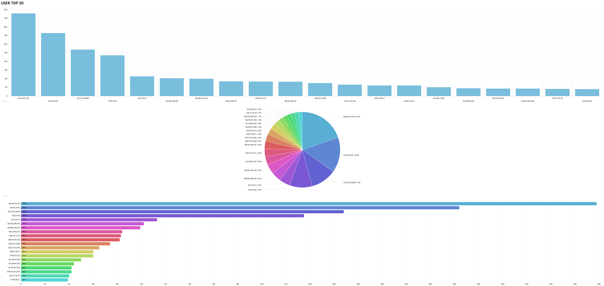
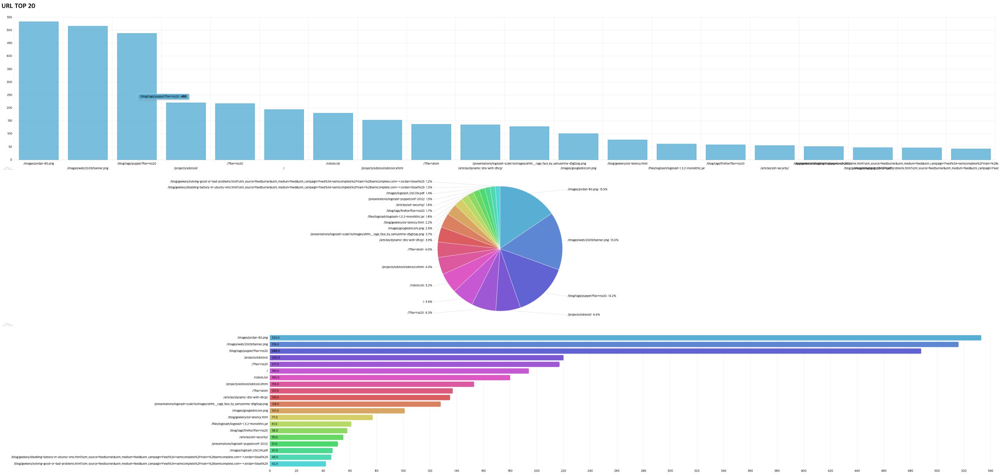
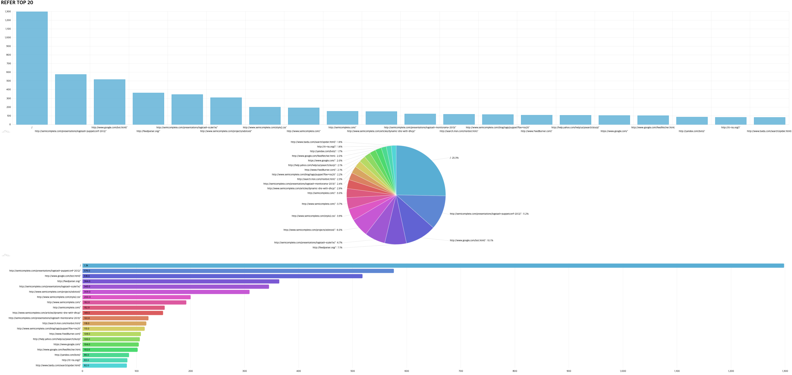

## 로그 분석 서버 

**이노베이션 아카데미 인턴십 프로젝트**

- 개발 기간: 2020년 8월 3일 ~ 

### 화면

- 가장 많이 접속한 유저(ip) 시각화

- 가장 많이 접속한 url 시각화

- 가장 많이 유입된 경로 (refer) 시각화

### 주요기능

---

- [ ] 로그 수집
- [x] 로그 분석
- [x] 로그 시각화

### 개발 환경 & 프레임워크

---

### Contributor

---

- [장준영](https://github.com/junyeongjang) (junyeongjang)

