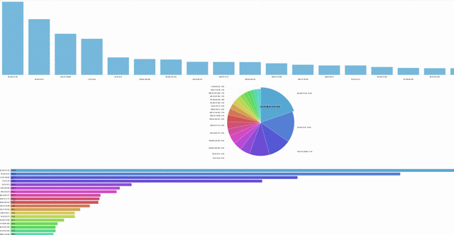

## 로그 분석 서버 

**이노베이션 아카데미 인턴십 프로젝트**

**웹 로그 분석기**

- 개발 기간: 2020/8/3 ~ 2020/8/19

### 프로젝트 시연

---

### 주요기능

---

- [ ] 로그 수집

  > 로그 수집은 생략했습니다. 대신 더미 데이터를 가지고 분석과 시각화를 진행했습니다.

- [x] 로그 분석

  > 

- [x] 로그 시각화

  > 

### 개발 환경 & 프레임워크

---

- 프론트 (시각화 툴) 
  - d3.js
  - amchart
- 서버
  - express

### 의존성

---

"dependencies": {

​    "cookie-parser": "~1.4.4",

​    "debug": "~2.6.9",

​    "ejs": "~2.6.1",

​    "express": "~4.16.1",

​    "express-validator": "^6.6.1",

​    "http-errors": "~1.6.3",

​    "morgan": "~1.9.1",

​    "nodemon": "^2.0.4"

  }

### 앞으로의 방향성 

---

### Contributor

---

- [장준영](https://github.com/junyeongjang) (junyeongjang)

